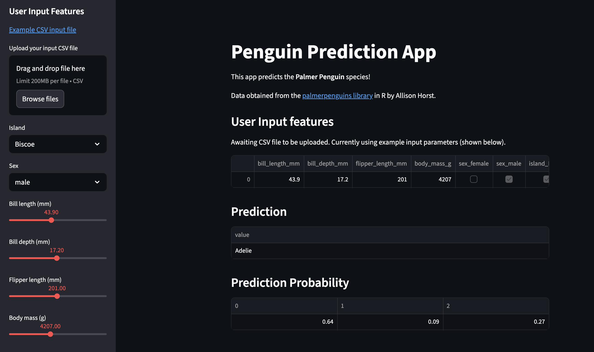
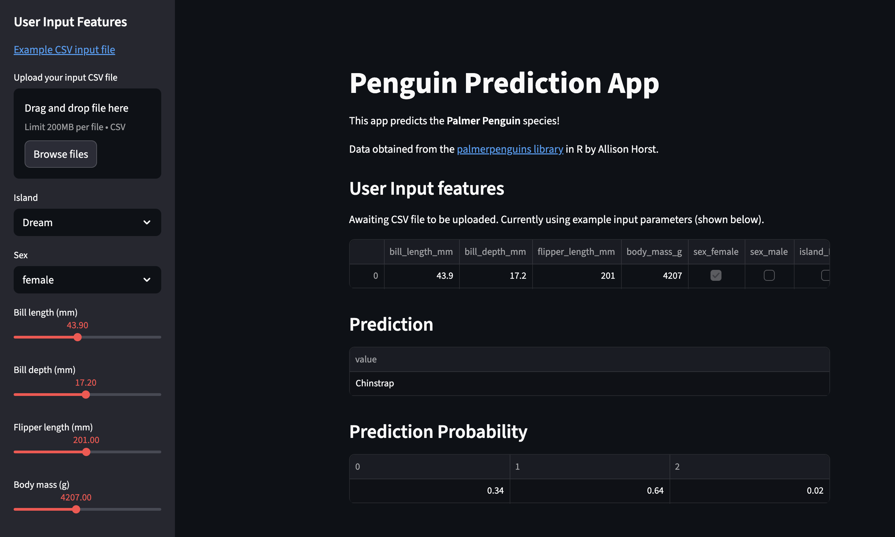

# 🐧 Classification Penguins

An interactive **Machine Learning web app** that predicts the species of **Palmer Penguins** based on their physical measurements and island of origin.  
Built using **Python**, **Streamlit**, and **scikit-learn**, this project demonstrates a complete ML workflow — from preprocessing and model training to deployment as a web app.

---

## 🚀 Features

- 🤖 **End-to-End ML Pipeline** — Covers dataset exploration, preprocessing, feature encoding, model training, and prediction.
- 🎛️ **Interactive UI** — Adjust penguin features (bill length, depth, flipper length, body mass, sex, island) using Streamlit sliders and dropdowns.
- 📦 **Batch & Single Predictions** — Supports both manual input and CSV uploads for batch inference.
- 📊 **Prediction Probability** — Displays confidence scores for each penguin species prediction.
- 🌐 **Web App Deployment Ready** — Easily deployable via Streamlit Cloud or similar platforms.

---

## 🧰 Tech Stack

- **Framework:** [Streamlit](https://streamlit.io/)
- **Model:** Random Forest Classifier (scikit-learn)
- **Libraries:** `pandas`, `numpy`, `scikit-learn`, `joblib`
- **Dataset:** [Palmer Penguins Dataset](https://github.com/allisonhorst/palmerpenguins)

---

## 📷 Application Preview

### 🖼️ 1. Prediction Example — _Adelie Penguin_

**Description:**  
This screenshot shows a **prediction result** where the app identifies the penguin as an **Adelie species**.

- The left panel allows the user to input features manually or upload a CSV file.
- The app dynamically updates the **predicted species** and displays **prediction probabilities** below.
- Example input values:
  - Island: `Biscoe`
  - Sex: `Male`
  - Bill length: `43.9 mm`
  - Bill depth: `17.2 mm`
  - Flipper length: `201 mm`
  - Body mass: `4207 g`

---

### 🖼️ 2. Prediction Example — _Chinstrap Penguin_

**Description:**  
Here, the app predicts the penguin as **Chinstrap species** based on a different combination of features.

- Island: `Dream`
- Sex: `Female`
- Physical measurements identical to the previous example but resulting in a different prediction.
- The probability table shows model confidence for each species class (Adelie, Chinstrap, Gentoo).

---

## 📈 How It Works

### 🧮 Data Preprocessing

- Encodes categorical features such as **sex** and **island**.
- Normalizes and prepares data for the **Random Forest** model.

### 🤖 Model Training

- Trained on the **Palmer Penguins** dataset to classify three species:  
  🐧 **Adelie**, 🐧 **Chinstrap**, and 🐧 **Gentoo**.
- Achieved high accuracy using the **Random Forest Classifier**.

### 🧭 User Interaction

- Input features manually via **sliders** and **dropdowns**, or upload a **CSV file** for batch predictions.
- The model outputs **predicted species** and corresponding **confidence probabilities**.

### 🧠 Prediction Visualization

- Displays the **predicted class** in a formatted results table.
- Shows a **probability distribution** across all species for interpretability.

---

## 🧑‍💻 Example Use Cases

- 🧬 Predict **penguin species** from real-world or field data.
- 🧠 Demonstrate **machine learning model deployment** using Streamlit.
- 🎓 Use as an **educational tool** for data preprocessing and Random Forest classification.
- 💼 Showcase a complete **AI workflow** for academic or professional portfolios.

---

## 🌟 Demo Highlights

- 🔧 Interactive parameter control
- 📊 Real-time prediction results
- 💾 Batch CSV upload for multiple predictions
- 🧠 Confidence probability display
- 🌙 Clean and modern **dark UI**

---

## 📜 License

This project is open source and available under the **[MIT License](LICENSE)**.

---

## 🙌 Acknowledgments

- 🐧 **Palmer Penguins Dataset** — by _Allison Horst_
- 💡 **Streamlit** — for simple and powerful web app development
- 🧠 **Data Professor** — for project inspiration and dataset structure

